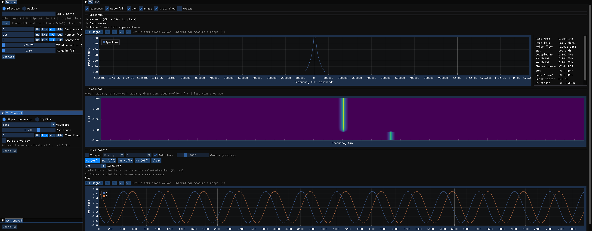
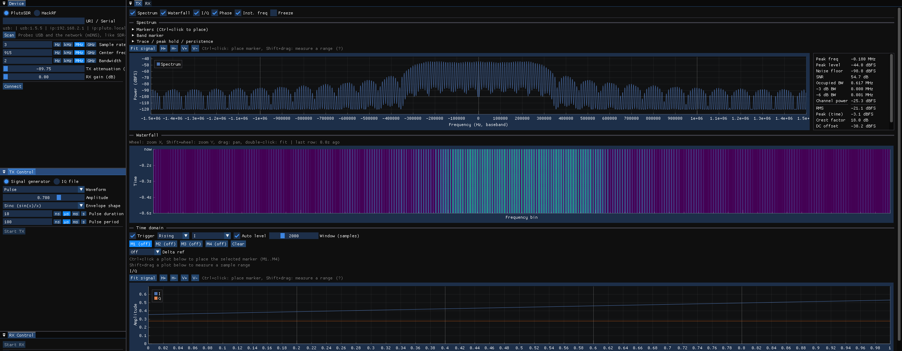
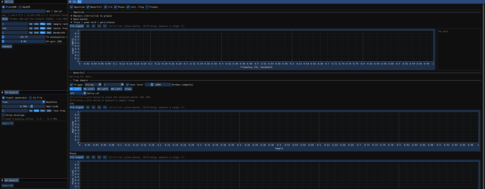

# IQ Forge

Десктопное GUI-приложение для приёма и передачи IQ-сигналов через SDR-оборудование.



## Возможности

### Поддержка устройств
- **PlutoSDR** и **HackRF**, с автоматическим поиском по USB/сети (mDNS/Avahi для PlutoSDR).
- Настраиваемые частота дискретизации, центральная частота, полоса пропускания, усиление TX/RX.
- Проверка связи с устройством в реальном времени — интерфейс сразу показывает, если устройство отключилось.

### Генерация сигнала (TX)
- Встроенный генератор с несколькими типами сигналов:
  - Одиночный тон
  - Мульти-тон
  - Чирп (линейная ЧМ, вверх или вниз)
  - Прямоугольный импульс
  - Баркер-кодированные BPSK-последовательности (все стандартные коды, длины 2–13)
  - Шум
  - Пила (ramp)
- Опциональная импульсная огибающая — любую форму сигнала (например, чирп) можно "открывать/закрывать", получая импульсный радароподобный сигнал. Форма огибающей настраивается отдельно: прямоугольная (жёсткое включение/выключение), sinc (sin(x)/x, несколько боковых лепестков), Gaussian или Hann — более плавные формы заметно сужают боковые лепестки спектра импульса по сравнению с прямоугольной.
- Передача из загруженного IQ-файла вместо генератора, с опциональным зацикливанием и ресемплингом при загрузке (см. ниже).
- Живое превью сигнала (временная область + спектр), ещё до нажатия Start TX — параметры применяются мгновенно, генератор (или загруженный файл) непрерывно считается в фоне и просто не уходит в эфир, пока TX не запущен.



#### Загрузка IQ-файла и ресемплинг
Raw-форматы (`.cf32`/`.ci16`) не хранят частоту дискретизации, с которой записаны — поэтому при включении **Resample on load** её нужно указать вручную:
- **File sample rate** — частота, с которой реально записан файл.
- **Resample coefficient** — дробный коэффициент пересчёта (не обязательно связан с частотой устройства — можно поставить любой).
- **Resulting rate** — вычисляется и показывается сразу (File sample rate × coefficient); если она не совпадает с текущей частотой дискретизации устройства, рядом жёлтым предупреждением об этом и напишет — сигнал в эфире будет ускорен/замедлен на разницу.

При первом включении Resample on load коэффициент подставляется автоматически так, чтобы Resulting rate сразу совпала с частотой устройства — дальше его можно свободно менять.

По кнопке **Load** файл читается и (если включено) ресемплится через libsamplerate (sinc-интерполяция с корректным антиалиасинговым фильтром — работает и на повышение, и на понижение частоты), сразу становясь виден в TX-панели (сигнал + спектр), ещё до Start TX — так же, как и с генератором. **Start TX** просто продолжает уже загруженный источник, без повторного чтения файла. Без ресемплинга (чекбокс выключен) файл используется как есть.

### Приём (RX)
- Живой просмотр принятых сэмплов во временной области и спектре.
- Прокручиваемая водопадная диаграмма (waterfall/спектрограмма).
- Запись принятых IQ-сэмплов на диск по требованию.



### Работа с IQ-файлами
- Загрузка и сохранение IQ-файлов в распространённых форматах:
  - Raw interleaved float32 (`.cf32`/`.fc32`)
  - Raw interleaved int16 (`.ci16`/`.sc16`)
  - PCM16 stereo WAV (`.wav`)
- Встроенный диалог выбора файлов.

### Визуализация

Каждое окно визуализации (TX и RX) объединяет в себе спектр, водопад, I/Q, фазу и мгновенную частоту — каждая панель включается/выключается своим чекбоксом.

**Freeze** — рядом с этими чекбоксами: ставит все графики этого направления (TX или RX по отдельности) на паузу, чтобы спокойно разглядеть/измерить статичную картинку — маркеры, зум, Shift-выделение по-прежнему работают. Сам приём/передача (и запись RX на диск, если включена) при этом не останавливаются, замирает только то, что нарисовано.

#### Управление масштабом (общее для всех графиков)
- **Колесо мыши** — зум по оси X.
- **Shift + колесо мыши** — зум по оси Y.
- **Перетаскивание (drag)** — панорамирование.
- **Shift + перетаскивание** — выделить диапазон, чтобы измерить именно его (см. ниже); отпустить — диапазон остаётся, приближает как обычный box-zoom. **Правая кнопка** во время выделения — отменить его.
- **Двойной клик** — сброс к автоподбору масштаба ("Fit signal").
- Кнопки **H+/H-/V+/V-** — зум по отдельной оси без мыши.

#### Спектр — маркеры и измерения
- **Маркеры M1–M4**: ставятся по **Ctrl+клик** по графику на выбранный (подсвеченный) маркер. Кнопки `M1`…`M4` над графиком выбирают, какой из маркеров сейчас "активен" для установки/поиска.
- **Peak search** — переносит активный маркер на самый сильный пик спектра.
- **Next peak** — переносит активный маркер на следующий по силе пик (поиск пиков учитывает превышение не менее 6 дБ над соседним провалом, чтобы шум не считался отдельными пиками).
- **-> Center freq** — перестраивает центральную частоту устройства на частоту активного маркера (если устройство подключено — переключает и реальное железо).
- **Delta ref** — выбор второго маркера как опорного: у активного маркера появляется показание Δ-частоты и Δ-амплитуды относительно опорного.
- **Clear** — снять текущий маркер.
- **Band marker** — включаемая полоса измерения: два края можно как перетаскивать мышью прямо на графике, так и задавать числами (Lo/Hi, Гц), либо просто **Shift + выделить** нужный диапазон на графике — полоса подставится сама, а её мощность/пик появятся и в панели управления, и подписью прямо под выделением. Показывает суммарную мощность в полосе и пиковое значение внутри неё.
- **Trace / peak hold / persistence**:
  - **Trace: Live / Max hold / Min hold** — режим отображаемой трассы (обычный live-спектр, накопление максимумов или минимумов по каждому бину). Кнопка **Reset hold** сбрасывает накопление.
  - **Peak hold** — независимый оверлей "пиковых значений с момента включения" (отдельно от режима Trace, можно включить одновременно с Live). **Clear peak hold** сбрасывает его.
  - **Persistence** — "послесвечение": на графике полупрозрачно остаются последние ~24 развёртки, более старые — более бледные. **Clear persistence** очищает историю.

#### Таблица измерений

Справа от спектра — компактная таблица, которая всегда считается автоматически (маркер ставить не нужно) по текущей развёртке и по сырому IQ-буферу:

| Показатель | Как считается |
|---|---|
| Peak freq / Peak level | частота и уровень глобального максимума спектра |
| Noise floor | медиана трассы (устойчива к паре узкополосных пиков) |
| SNR | Peak level − Noise floor |
| Occupied BW | самая узкая полоса, содержащая 99% суммарной мощности (по 0.5% отсекается с каждого края) |
| -3 dB BW / -6 dB BW | ширина главного лепестка вокруг пика на уровне −3 дБ и −6 дБ от него |
| Channel power | суммарная мощность по всей отображаемой полосе (интеграл по всем бинам) |
| RMS / Peak (time) | среднеквадратичное и пиковое значение \|I+jQ\| по сырому буферу сэмплов |
| Crest factor | Peak (time) − RMS |
| DC offset | уровень модуля среднего комплексного значения сэмплов относительно полной шкалы |
| Clipping | число (и доля) сэмплов с \|I\| или \|Q\| ≥ 0.999 — признак насыщения АЦП/ЦАП |

Второй набор измерений (SINAD, THD, SFDR, ACPR, frequency error, I/Q gain imbalance, quadrature error, EVM) пока не реализован — в планах.

#### Временная область — маркеры и триггер

Те же маркеры M1–M4, что и на спектре (Ctrl+клик — поставить выбранный), только общие сразу для трёх графиков — I/Q, фазы и мгновенной частоты: маркер, поставленный на одном, сразу виден на всех трёх.

- Кнопки `M1`…`M4` выбирают активный маркер, `Clear` снимает его.
- **Delta ref** — как и на спектре: у активного маркера появляется показание относительно выбранного опорного маркера — **dt** (интервал времени, он же измерение периода сигнала), **1/dt** (частота) и **dAmplitude** (разница |I+jQ|).
- **Shift + выделение** диапазона сэмплов на любом из трёх графиков — тоже общее для всех троих. Под маркерами появляется строка с RMS/Peak/Crest factor/DC offset/Clipping, посчитанными только по выделенному участку (та же формула, что и в таблице измерений спектра, только по сырому куску буфера, а не по всей развёртке).
- **Триггер** (панель над I/Q-графиком): включение, фронт (rising/falling), источник (I/Q/модуль), авто- или ручной уровень, размер окна. Текущий уровень триггера отображается на графике I/Q горизонтальной линией.

## Сборка

```sh
cmake -B build
cmake --build build
```

Требуются пакеты: GLFW, OpenGL, libiio, fftw3f и libhackrf. `imgui`, `implot` и `libsamplerate` подтягиваются сами через FetchContent.

## Запуск тестов

```sh
cmake --build build --target test
```
